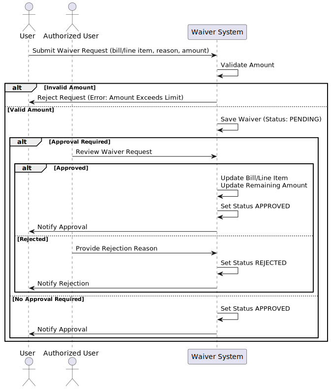
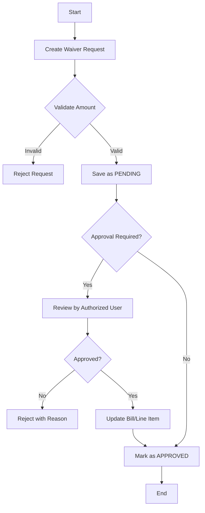

# Bill Waiver Documentation

## Table of Contents
- [Overview](#overview)
- [Database Schema](#database-schema)
- [API Endpoints](#api-endpoints)
- [Business Rules](#business-rules)
- [User Roles and Permissions](#user-roles-and-permissions)
- [Process Flow](#process-flow)
- [Example Scenarios](#example-scenarios)
- [Error Handling](#error-handling)
- [Best Practices](#best-practices)

## Overview
The Bill Waiver system in KenyaEMR Cashier module enables authorized users to partially or completely waive bills or specific line items. This functionality is crucial for:
- Providing financial assistance to patients in need
- Handling special cases requiring service cost reduction
- Managing institutional policies for service waivers

## Waiver Process




## Database Schema

### Table: cashier_bill_waiver

| Field | Type | Description | Constraints |
|-------|------|-------------|-------------|
| waiver_id | int | Primary key | Auto-increment |
| bill_id | int | Reference to bill | Not null, Foreign key |
| line_item_id | int | Reference to line item | Nullable, Foreign key |
| requested_by | int | User who requested | Not null, Foreign key |
| approved_by | int | User who approved | Nullable, Foreign key |
| reason | varchar(500) | Waiver reason | Not null |
| waived_amount | decimal(10,2) | Amount waived | Not null |
| original_amount | decimal(10,2) | Original total | Not null |
| remaining_amount | decimal(10,2) | Remaining amount | Not null |
| status | varchar(10) | Waiver status | Not null |
| rejection_reason | varchar(500) | Rejection reason | Nullable |

## API Endpoints

### 1. Create Waiver Request
```http
POST /ws/rest/v1/cashier/billWaiver
Content-Type: application/json

{
    "bill": "bill-uuid-here",
    "reason": "Patient cannot afford the full amount",
    "waivedAmount": 1000.00
}
```

### 2. Create Line Item Waiver
```http
POST /ws/rest/v1/cashier/billWaiver
Content-Type: application/json

{
    "bill": "bill-uuid-here",
    "lineItem": "line-item-uuid-here",
    "reason": "Partial waiver for medication",
    "waivedAmount": 500.00
}
```

### 3. Approve Waiver
```http
POST /ws/rest/v1/cashier/billWaiver/{waiver-uuid}
Content-Type: application/json

{
    "status": "APPROVED"
}
```

### 4. Reject Waiver
```http
POST /ws/rest/v1/cashier/billWaiver/{waiver-uuid}
Content-Type: application/json

{
    "status": "REJECTED",
    "rejectionReason": "Insufficient documentation"
}
```

## Business Rules

### 1. Amount Validation
- **Line Item Waivers**:
  - Cannot exceed line item's remaining amount
  - Original amount = line item total
  - Remaining amount = line item remaining - waived amount

- **Bill Waivers**:
  - Cannot exceed bill's remaining amount
  - Original amount = bill total
  - Remaining amount = bill total - payments - waived amount

### 2. Status Management
- **PENDING**: Initial state
- **APPROVED**: After approval
- **REJECTED**: After rejection
- Status changes are irreversible

### 3. Approval Effects
- **Line Items**:
  - Updates remaining amount
  - Sets status to PAID if fully waived
  - Sets status to POSTED if partially waived

- **Bills**:
  - Updates total remaining amount
  - Sets status to PAID if fully waived

## User Roles and Permissions

### 1. Regular Users
- Create waiver requests
- View own waiver requests
- Cannot approve/reject waivers

### 2. Authorized Users
- Create waiver requests
- Approve/reject waiver requests
- View all waiver requests
- Manage bills

### Required Privileges
- `MANAGE_BILLS`: For creating/approving waivers
- `VIEW_BILLS`: For viewing waivers

## Process Flow



## Example Scenarios

### Scenario 1: Full Bill Waiver
```json
{
    "bill": "123e4567-e89b-12d3-a456-426614174000",
    "reason": "Patient is a vulnerable case",
    "waivedAmount": 5000.00
}
```

### Scenario 2: Partial Line Item Waiver
```json
{
    "bill": "123e4567-e89b-12d3-a456-426614174000",
    "lineItem": "987fcdeb-51a2-43d7-9012-345678901234",
    "reason": "Partial waiver for medication",
    "waivedAmount": 1000.00
}
```

## Error Handling

### Common Errors

1. **Amount Exceeds Limit**
   ```
   Error: "Waived amount cannot exceed the remaining amount"
   Solution: Verify remaining amount and adjust waiver
   ```

2. **Missing Required Fields**
   ```
   Error: "Field 'original_amount' doesn't have a default value"
   Solution: Ensure bill/line item exists with valid amounts
   ```

3. **Invalid Status Change**
   ```
   Error: "Only pending waivers can be approved/rejected"
   Solution: Check current status before changing
   ```

## Best Practices

### 1. Documentation
- Provide clear, detailed reasons
- Document special circumstances
- Maintain approval records

### 2. Amount Management
- Verify amounts before creating waivers
- Consider partial waivers for large amounts
- Track cumulative waived amounts

### 3. Approval Process
- Implement review process for large waivers
- Maintain audit trail
- Regular review of waiver patterns

### 4. Monitoring
- Regular audit of waiver approvals
- Monitor for potential abuse
- Review waiver patterns

### 5. Security
- Regular review of user permissions
- Log all waiver activities
- Implement approval thresholds

## Implementation Notes

### Java Code Example
```java
// Creating a waiver
IBillWaiverService service = Context.getService(IBillWaiverService.class);
BillWaiver waiver = service.createWaiver(bill, null, 
    new BigDecimal("1000.00"), 
    "Patient cannot afford the full amount");

// Approving a waiver
waiver.setStatus(WaiverStatus.APPROVED);
service.approveWaiver(waiver);

// Rejecting a waiver
service.rejectWaiver(waiver, "Insufficient documentation");
```

### Database Queries
```sql
-- Get all waivers for a bill
SELECT * FROM cashier_bill_waiver 
WHERE bill_id = ? AND voided = 0;

-- Get pending waivers
SELECT * FROM cashier_bill_waiver 
WHERE status = 'PENDING' AND voided = 0;
```

## Support and Maintenance

### Regular Tasks
1. Review waiver patterns
2. Audit approval processes
3. Update user permissions
4. Monitor system performance

### Troubleshooting
1. Check database constraints
2. Verify user permissions
3. Review audit logs
4. Validate amount calculations

## Future Enhancements

1. Multi-level approval process
2. Automated approval rules
3. Enhanced reporting
4. Integration with financial systems
5. Mobile approval workflow 